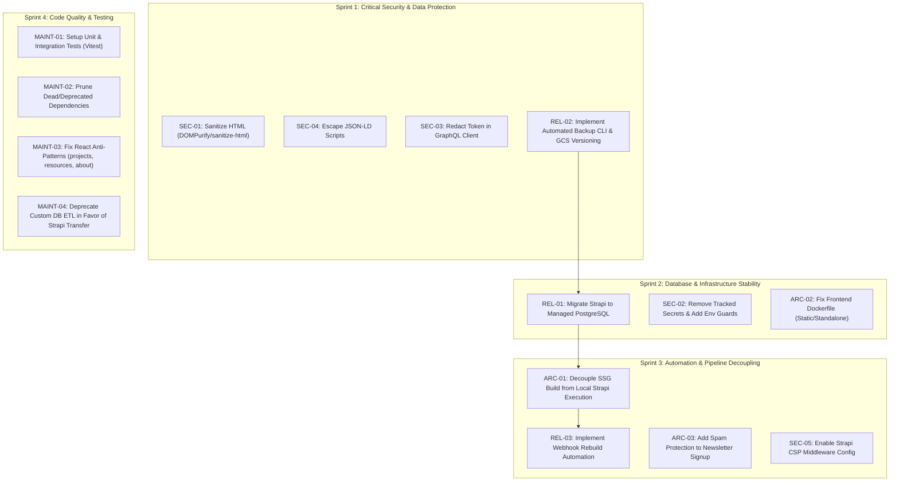

# Project Architecture, Security & Code Quality Audit Report

> **Last Updated:** August 2026  
> **Status:** Active Tracking & Remediation Plan (Incorporating findings and completed remediations from [`audit-prompt.md`](./audit-prompt.md))

---

## 1. Executive Verdict

The current architecture partially achieves its static-export goal by generating an SSG frontend deployed to Vercel, but it fails to provide a robust, automated staging-to-production pipeline. The staging CMS relies on an SQLite database running on Google Cloud Run via Google Cloud Storage FUSE (`gcsfuse`), creating a severe risk of database corruption and unrecoverable data loss due to the lack of POSIX file-locking support on object storage. Furthermore, the webhook automation that should trigger rebuilds upon content changes is an unimplemented stub, and unsanitized author HTML is injected directly into client DOMs via `dangerouslySetInnerHTML`.

---

## 2. Active Findings Table

| ID           | Finding                                                                                                                        | Severity     | Effort | Change Risk | Blocked By / Blocks                      | Evidence                                                                                                                                                                                                                                                                                                                                      |
| :----------- | :----------------------------------------------------------------------------------------------------------------------------- | :----------- | :----- | :---------- | :--------------------------------------- | :-------------------------------------------------------------------------------------------------------------------------------------------------------------------------------------------------------------------------------------------------------------------------------------------------------------------------------------------- |
| **SEC-01**   | Stored XSS via unsanitized rich text rendering in `HTMLContent`                                                                | **Critical** | Low    | Low         | Blocks nothing                           | [frontend/components/common/htmlContent.tsx:1-36](../frontend/components/common/htmlContent.tsx#L1-L36)                                                                                                                                                                                                                                       |
| **REL-01**   | SQLite database on Google Cloud Run via GCS FUSE                                                                               | **Critical** | High   | High        | Blocks **REL-03**, **ARC-01**            | [backend/config/database.ts:13-48](../backend/config/database.ts#L13-L48), [docker/gcs_fuse.dockerfile:1-66](../docker/gcs_fuse.dockerfile#L1-L66), [docs/deployment.md:53-110](../docs/deployment.md#L53-L110)                                                                                                                               |
| **REL-02**   | Absence of dedicated, automated backup & restore mechanism for CMS                                                             | **High**     | Medium | Low         | Blocks **REL-01**                        | [scripts/src/commands/strapi/import/db.ts:77-101](../scripts/src/commands/strapi/import/db.ts#L77-L101), [scripts/src/commands/strapi/export/db.ts:149-155](../scripts/src/commands/strapi/export/db.ts#L149-L155)                                                                                                                            |
| **REL-03**   | Incomplete build-trigger webhook stub (`preview-webhook.yml`)                                                                  | **High**     | Low    | Low         | Blocked by **ARC-01**                    | [.github/workflows/preview-webhook.yml:1-15](../.github/workflows/preview-webhook.yml#L1-L15)                                                                                                                                                                                                                                                 |
| **SEC-02**   | Hardcoded fallback secrets in tracked environment definitions                                                                  | **High**     | Low    | Medium      | Blocks nothing                           | [config/development.env:4-11](../config/development.env#L4-L11), [config/docker.env:37-41](../config/docker.env#L37-L41)                                                                                                                                                                                                                      |
| **ARC-01**   | CI build pipeline over-complexity (Strapi local spin-up in CI runner)                                                          | **Medium**   | Medium | Medium      | Blocked by **REL-01**; Blocks **REL-03** | [.github/workflows/preview.yml:72-87](../.github/workflows/preview.yml#L72-L87), [scripts/src/commands/cli/build-deploy-ssg.ts:156-170](../scripts/src/commands/cli/build-deploy-ssg.ts#L156-L170)                                                                                                                                            |
| **ARC-02**   | Frontend Docker image runs Next.js development server (`next dev`)                                                             | **Medium**   | Low    | Low         | Blocks nothing                           | [docker/frontend.dockerfile:57](../docker/frontend.dockerfile#L57)                                                                                                                                                                                                                                                                            |
| **ARC-03**   | Newsletter signup serverless function creates host lock-in & lacks spam protection                                             | **Medium**   | Low    | Low         | Blocks nothing                           | [frontend/api/newsletter-signup.mjs:1-47](../frontend/api/newsletter-signup.mjs#L1-L47), [frontend/vercel.json:8-13](../frontend/vercel.json#L8-L13)                                                                                                                                                                                          |
| **SEC-03**   | Token disclosure in GraphQL client error handling                                                                              | **Medium**   | Low    | Low         | Blocks nothing                           | [frontend/lib/graphql.tsx:47-55](../frontend/lib/graphql.tsx#L47-L55)                                                                                                                                                                                                                                                                         |
| **SEC-04**   | Potential JSON-LD script context breakout in `SEO` component                                                                   | **Medium**   | Low    | Low         | Blocks nothing                           | [frontend/components/common/seo.tsx:91-96](../frontend/components/common/seo.tsx#L91-L96)                                                                                                                                                                                                                                                     |
| **SEC-05**   | Unused Content Security Policy definitions in Strapi middlewares                                                               | **Low**      | Low    | Low         | Blocks nothing                           | [backend/config/middlewares.ts:8-35](../backend/config/middlewares.ts#L8-L35)                                                                                                                                                                                                                                                                 |
| **MAINT-01** | Complete absence of automated unit, integration, or E2E tests                                                                  | **Low**      | High   | Low         | Blocks nothing                           | [package.json:10-23](../package.json#L10-L23), [frontend/package.json:6-14](../frontend/package.json#L6-L14)                                                                                                                                                                                                                                  |
| **MAINT-02** | Dead, deprecated, and conflicting dependencies (`bookshelf`, `tslint`, `pg`, `socket.io`)                                      | **Low**      | Low    | Low         | Blocks nothing                           | [backend/package.json:29-33](../backend/package.json#L29-L33), [frontend/package.json:20](../frontend/package.json#L20), [frontend/package.json:46-47](../frontend/package.json#L46-L47)                                                                                                                                                      |
| **MAINT-03** | React/TypeScript anti-patterns (sort comparator, nested `<button>` in `<Link>`, non-deterministic shuffle, sequential queries) | **Low**      | Low    | Low         | Blocks nothing                           | [frontend/pages/projects.tsx:22-26](../frontend/pages/projects.tsx#L22-L26), [frontend/pages/resources.tsx:11-33](../frontend/pages/resources.tsx#L11-L33), [frontend/pages/about.tsx:37-40](../frontend/pages/about.tsx#L37-L40), [frontend/components/common/dynamic.tsx:22-24, 89-108](../frontend/components/common/dynamic.tsx#L89-L108) |
| **MAINT-04** | Fragile custom database sync/ETL code duplicating Strapi v5 native tooling                                                     | **Low**      | Medium | Low         | Blocks nothing                           | [scripts/src/commands/strapi/export/db.ts:15-146](../scripts/src/commands/strapi/export/db.ts#L15-L146), [scripts/src/commands/strapi/import/db.ts:21-301](../scripts/src/commands/strapi/import/db.ts#L21-L301)                                                                                                                              |

---

## 3. Resolved / Remediated Findings

| ID         | Issue (Prior Audit ID)                                     |  Severity  |     Status      | Resolution Summary                                                                                                                                                              | Evidence                                                                                                                                                           |
| :--------- | :--------------------------------------------------------- | :--------: | :-------------: | :------------------------------------------------------------------------------------------------------------------------------------------------------------------------------ | :----------------------------------------------------------------------------------------------------------------------------------------------------------------- |
| **RES-01** | Blank Root Route (`pages/index.tsx`) & Host Lock-In (P2.3) | **Medium** | 🟢 **Resolved** | Created full `pages/index.tsx` static homepage with `getStaticProps` query logic and added unified `/home` -> `/` redirects in `next.config.js` and `vercel.json`.              | [frontend/pages/index.tsx:1-115](../frontend/pages/index.tsx#L1-L115), [frontend/next.config.js:84-91](../frontend/next.config.js#L84-L91)                         |
| **RES-02** | Missing Custom Document & HTML `lang="en"` (P4.1)          |  **Low**   | 🟢 **Resolved** | Implemented `pages/_document.tsx` with `<Html lang="en">`, font preloads (`roboto-400.woff2`), and DNS preconnects for Google Cloud Storage.                                    | [frontend/pages/\_document.tsx:1-18](../frontend/pages/_document.tsx#L1-L18)                                                                                       |
| **RES-03** | Missing SEO, OpenGraph & Schema.org Structured Data (P4.2) |  **Low**   | 🟢 **Resolved** | Built unified `components/common/seo.tsx`, `lib/schemaOrg.ts` structured data generator (NGO, BlogPosting, FAQPage, CreativeWork), and `components/common/ResponsiveImage.tsx`. | [frontend/components/common/seo.tsx:1-102](../frontend/components/common/seo.tsx#L1-L102), [frontend/lib/schemaOrg.ts:1-150](../frontend/lib/schemaOrg.ts#L1-L150) |

---

## 4. Detailed Active Findings

### Critical Severity

#### SEC-01: Stored XSS via Unsanitized Rich Text Rendering in `HTMLContent`

- **Area**: Security
- **File & Lines**: [frontend/components/common/htmlContent.tsx:1-36](../frontend/components/common/htmlContent.tsx#L1-L36)
- **Status**: `[Confirmed]`
- **Description**: The `HTMLContent` component injects author-provided markup into the DOM using `dangerouslySetInnerHTML={{ __html: cleanHTML(children) }}`. The helper function `cleanHTML()` only applies two regular expression replacements: one stripping four specific CSS style attributes (`background-color`, `color`, `background`, `font-family`) and another stripping empty `<p>` tags. It performs zero sanitization of HTML tags (`<script>`, `<iframe>`, `<embed>`, `<object>`, `<svg onload>`, ``) or event handler attributes (`onload`, `onerror`, `onclick`, `javascript:` URIs).
- **Why It Matters**: Exploitability × Blast Radius: Stored XSS in a CMS payload rendered across the statically generated site. Any content author or attacker with write access to the CMS can inject malicious JavaScript that will be embedded into the static HTML generated during SSG builds and executed in the browser of every visitor on the production domain.
- **Remediation**:
  Replace manual regex stripping with an established sanitization library such as `dompurify` (with `jsdom` during SSG / build-time) or `sanitize-html`. Configure an allowlist that permits standard formatting tags (`p`, `strong`, `em`, `u`, `h1`-`h6`, `ul`, `ol`, `li`, `blockquote`, `a`, `img`, `table`, `thead`, `tbody`, `tr`, `th`, `td`) while stripping scripts, object tags, and event handlers.

  ```diff
  + import sanitizeHtml from "sanitize-html";

  - function cleanHTML(html: string) {
  -   html = stripStyles(html);
  -   html = replaceEmptyLines(html);
  -   return html;
  - }
  + function cleanHTML(html: string) {
  +   const sanitized = sanitizeHtml(html, {
  +     allowedTags: sanitizeHtml.defaults.allowedTags.concat(["img", "h1", "h2", "h3"]),
  +     allowedAttributes: {
  +       ...sanitizeHtml.defaults.allowedAttributes,
  +       img: ["src", "alt", "width", "height"],
  +       a: ["href", "name", "target", "rel"],
  +     },
  +   });
  +   return replaceEmptyLines(stripStyles(sanitized));
  + }
  ```

  - _Side Effects & Breakage_: If authors previously relied on custom embedded `<iframe>` elements (e.g. YouTube/Vimeo embeds), they will be stripped unless explicitly allowed in the `allowedTags` and `allowedIframeHostnames` configuration. Existing Strapi rich-text content must be audited for valid embedded media before deploying.
  - _Migration/Backfill_: None required in database.

---

#### REL-01: SQLite Database on Google Cloud Run via GCS FUSE

- **Area**: Reliability & Data Integrity
- **File & Lines**:
  - [backend/config/database.ts:13-48](../backend/config/database.ts#L13-L48)
  - [docker/gcs_fuse.dockerfile:1-66](../docker/gcs_fuse.dockerfile#L1-L66)
  - [docs/deployment.md:53-110](../docs/deployment.md#L53-L110)
- **Status**: `[Confirmed]`
- **Description**: The staging Strapi backend runs as a containerized service on Google Cloud Run with an SQLite database persisted to a Google Cloud Storage bucket mounted via `gcsfuse` (documented in `docs/deployment.md:53-56`). The database configuration in `backend/config/database.ts:21-46` enables WAL (`write-ahead logging`) mode and acknowledges write-lock issues with comments: `// HACK - when deploying to GCP init will fail due to write-lock if multiple processes so for now avoid pooling`.
- **Why It Matters**: Probability × Recoverability: Google Cloud Storage is an object store, not a POSIX-compliant file system. `gcsfuse` does not support byte-range locking (`fcntl`/`flock`) or memory-mapped files (`mmap`), which are fundamentally required for SQLite's ACID guarantees and WAL mode (`-wal` and `-shm` files). When Cloud Run scales, performs zero-downtime container replacements, or receives concurrent requests, simultaneous writes will cause irreversible SQLite database corruption ("newest write wins" object overwrite).
- **Remediation**:
  Migrate the staging Strapi database from SQLite-over-GCSFUSE to a managed PostgreSQL database (e.g., Google Cloud SQL PostgreSQL, Supabase, or Neon). The Strapi configuration already includes a PostgreSQL client adapter (`backend/config/database.ts:51-70` and `pg` dependency).
  ```typescript
  // Set DATABASE_CLIENT=postgres in staging container environment variables
  DATABASE_CLIENT=postgres
  DATABASE_HOST=/cloudsql/<INSTANCE_CONNECTION_NAME>
  DATABASE_PORT=5432
  DATABASE_NAME=strapi
  DATABASE_USERNAME=strapi
  DATABASE_PASSWORD=<SECRET>
  ```
  - _Side Effects & Breakage_: Requires provisioning a PostgreSQL database instance, setting connection environment variables in Cloud Run, and migrating current data from `data/db/sami-production.db` into PostgreSQL using the custom sync scripts or Strapi Data Transfer (`strapi transfer`).
  - _Migration/Backfill_: Database export & import backfill required.

---

### High Severity

#### REL-02: Absence of Dedicated, Automated Backup & Restore Mechanism for CMS

- **Area**: Reliability & Data Integrity
- **File & Lines**:
  - [scripts/src/commands/strapi/import/db.ts:77-101](../scripts/src/commands/strapi/import/db.ts#L77-L101)
  - [scripts/src/commands/strapi/export/db.ts:149-155](../scripts/src/commands/strapi/export/db.ts#L149-L155)
- **Status**: `[Confirmed]`
- **Description**: There is no standalone automated backup command, scheduled backup job, or tested restore path for the CMS database and assets. The only backup logic that exists is `DBImport.backupData()` in `scripts/src/commands/strapi/import/db.ts:77-101`, which runs solely as an incidental side-effect when a developer executes `yarn scripts strapi import`. Crucially, there is no corresponding restore command—restoring requires manual disassembly of the JSON backup file back into `data/db-json/`. Additionally, `shouldIncludeTableInExport` in `scripts/src/commands/strapi/export/db.ts:149-155` explicitly skips all `admin_*`, `strapi_*`, and `up_*` tables, leaving administrative accounts, role permissions, and API tokens unbacked up.
- **Why It Matters**: Probability × Recoverability: In the event of data corruption, accidental deletion by authors, or schema failure, there is no documented or automated recovery mechanism.
- **Remediation**:
  1. Implement a dedicated CLI backup and restore command: `yarn scripts strapi backup` and `yarn scripts strapi restore --file <path>`.
  2. For SQLite (current), leverage `sqlite3 sami-production.db ".backup 'backup.db'"` or enable Object Versioning on the GCS bucket (`sami_website_db`).
  3. For PostgreSQL (post-migration), configure automated daily backups with retention in Cloud SQL or the managed provider.
  - _Side Effects & Breakage_: None.
  - _Migration/Backfill_: None required.

---

#### REL-03: Incomplete Build-Trigger Webhook Stub (`preview-webhook.yml`)

- **Area**: Architecture / Automation
- **File & Lines**: [.github/workflows/preview-webhook.yml:1-15](../.github/workflows/preview-webhook.yml#L1-L15)
- **Status**: `[Confirmed]`
- **Description**: The webhook handler defined in `.github/workflows/preview-webhook.yml` listens for `repository_dispatch` events with type `production_preview`, but contains only an `echo $MESSAGE` step with a comment `# TODO - trigger preview build` (line 14).
- **Why It Matters**: The core headless CMS workflow requirement ("Content changes on staging trigger a rebuild + redeploy of the static production site") is not operational. Content authors publishing articles on Strapi cannot trigger production deployments without manual developer intervention (pushing to `main` or manually running `workflow_dispatch` on `preview.yml`).
- **Remediation**:
  Update `preview-webhook.yml` to invoke the build and deploy job using `workflow_call` or trigger `preview.yml` directly.
  ```yaml
  name: Staging Webhook Build
  on:
    repository_dispatch:
      types: [production_preview, strapi_publish]
  jobs:
    trigger-build:
      uses: ./.github/workflows/preview.yml
      secrets: inherit
  ```
  - _Side Effects & Breakage_: Requires configuring Strapi Webhooks (`Settings -> Webhooks` in Strapi Admin) to send a POST request with a GitHub Personal Access Token to `https://api.github.com/repos/<owner>/<repo>/dispatches`.
  - _Migration/Backfill_: None.

---

#### SEC-02: Hardcoded Fallback Secrets in Tracked Environment Definitions

- **Area**: Security
- **File & Lines**:
  - [config/development.env:4-11](../config/development.env#L4-L11)
  - [config/docker.env:37-41](../config/docker.env#L37-L41)
- **Status**: `[Confirmed]`
- **Description**: `config/development.env` and `config/docker.env` are tracked in version control and define static placeholder secrets:
  - `APP_KEYS=testkey1,testkey2`
  - `API_TOKEN_SALT=test_salt`
  - `TRANSFER_TOKEN_SALT=test_salt`
  - `ADMIN_JWT_SECRET=test_secret`
  - `JWT_SECRET=dGVzdF9qd3Rfc2VjcmV0`
  - `RESEND_API_KEY=re_123`
- **Why It Matters**: Exploitability × Blast Radius: If container deployments or staging environments fail to inject explicit environment variables (or if `docker.env` is loaded directly by Docker Compose without `.env.local` overrides), Strapi runs with known static secrets. An attacker can forge JWT tokens to gain full administrative access over Strapi or generate valid API access tokens.
- **Remediation**:
  1. Remove secret keys from tracked `.env` files and provide `.env.example` templates containing empty variable declarations.
  2. Add runtime assertions in `backend/config/server.ts` and `backend/config/admin.ts` ensuring production and docker environments abort startup if secret keys equal known test defaults.
  ```typescript
  // backend/config/admin.ts
  const secret = env("ADMIN_JWT_SECRET");
  if (process.env.NODE_ENV !== "development" && (!secret || secret === "test_secret")) {
    throw new Error("Fatal: Insecure ADMIN_JWT_SECRET configured for non-development environment.");
  }
  ```
  - _Side Effects & Breakage_: Builds will fail fast if environment variables are not properly provisioned in deployment targets.
  - _Migration/Backfill_: Rotate any staging credentials previously deployed with test secrets.

---

### Medium Severity

#### ARC-01: Build Pipeline Over-Complexity (Local Strapi Spin-Up in CI)

- **Area**: Architecture / Build Pipeline
- **File & Lines**:
  - [.github/workflows/preview.yml:72-87](../.github/workflows/preview.yml#L72-L87)
  - [scripts/src/commands/cli/build-deploy-ssg.ts:156-170](../scripts/src/commands/cli/build-deploy-ssg.ts#L156-L170)
- **Status**: `[Confirmed]`
- **Description**: To build the static frontend in CI, `.github/workflows/preview.yml` synchronizes the production SQLite database (`gcloud storage rsync gs://sami_website_db`), starts a full Strapi server process (`yarn start`) in the background of the runner, polls port 1337 via `wait-on`, executes `next build` to query the local GraphQL endpoint, terminates Strapi, and uploads the export to Vercel via the Vercel CLI.
- **Why It Matters**: This architecture creates high friction and fragility:
  1. The static build depends on GCP credentials, `gcloud` SDK, and GCS bucket access in CI.
  2. Local background process management via `concurrently` and `wait-on` in CI runners is vulnerable to port-binding timeouts and memory limits.
  3. It prevents the site from being built directly on modern static web hosts (e.g. Cloudflare Pages, Netlify, or native Vercel Git integration) without external CI runners.
- **Remediation**:
  Configure the Next.js static build to fetch GraphQL data directly over HTTPS from the live Strapi staging endpoint (`https://admin.samicharity.co.uk/graphql` or Cloud Run domain) using `STRAPI_READONLY_TOKEN`. This eliminates `gcloud rsync`, local Strapi execution, and background process orchestration during frontend builds.
  - _Side Effects & Breakage_: Staging Strapi endpoint must be reachable from GitHub Actions / Vercel build runners and protected by read-only API tokens.
  - _Migration/Backfill_: None.

---

#### ARC-02: Frontend Docker Image Runs Next.js Development Server (`next dev`)

- **Area**: Architecture / Docker
- **File & Lines**: [docker/frontend.dockerfile:57](../docker/frontend.dockerfile#L57)
- **Status**: `[Confirmed]`
- **Description**: The Dockerfile for the frontend container specifies `CMD ["next", "dev"]`.
- **Why It Matters**: Running `next dev` in a deployed container (staging or preview) disables Next.js production compiler optimizations, incurs heavy memory usage, exposes internal development server endpoints/telemetry, and fails to simulate true production static export behaviors.
- **Remediation**:
  Configure the Dockerfile to either:
  1. Use Next.js `standalone` output mode (`CMD ["node", "server.js"]`), or
  2. Serve the static export (`out/`) using a lightweight static web server like `nginx-alpine` or `serve`.
  ```dockerfile
  # docker/frontend.dockerfile
  FROM nginx:alpine
  COPY --from=builder /app/frontend/out /usr/share/nginx/html
  EXPOSE 80
  CMD ["nginx", "-g", "daemon off;"]
  ```
  - _Side Effects & Breakage_: Image rebuild required.
  - _Migration/Backfill_: None.

---

#### ARC-03: Newsletter Signup Serverless Function Creates Host Lock-In & Lacks Spam Protection

- **Area**: Architecture / Portability & Security
- **File & Lines**:
  - [frontend/api/newsletter-signup.mjs:1-47](../frontend/api/newsletter-signup.mjs#L1-L47)
  - [frontend/vercel.json:8-13](../frontend/vercel.json#L8-L13)
- **Status**: `[Confirmed]`
- **Description**: The newsletter subscription endpoint is implemented as a Vercel-specific serverless function in `frontend/api/newsletter-signup.mjs`, configured via `frontend/vercel.json`. Because Next.js is configured with `output: "export"`, API routes are not part of the static bundle. Furthermore, the endpoint lacks rate limiting, CAPTCHA validation (e.g. Cloudflare Turnstile), or honeypot fields.
- **Why It Matters**: It prevents the site from deploying seamlessly to non-Vercel static hosting providers (Cloudflare Pages, S3, Netlify) without rewriting the backend handler, and leaves the Mailchimp list open to automated form-fill spam / bot abuse.
- **Remediation**:
  1. Add a honeypot field or Turnstile CAPTCHA validation to the form handler.
  2. For pure static host portability, either direct submissions to Mailchimp's client-side embedded form endpoint with JSONP/CORS, or provide an Edge-compatible worker template.
  - _Side Effects & Breakage_: Form components will need CAPTCHA/honeypot integration.
  - _Migration/Backfill_: None.

---

#### SEC-03: Token Disclosure in GraphQL Client Error Handling

- **Area**: Security
- **File & Lines**: [frontend/lib/graphql.tsx:47-55](../frontend/lib/graphql.tsx#L47-L55)
- **Status**: `[Confirmed]`
- **Description**: In `serverQuery`, if a GraphQL request returns a "Forbidden access" error, the error handler throws:
  `throw new Error("Invalid access token:" + STRAPI_READONLY_TOKEN);`
- **Why It Matters**: If authentication fails during a build or preview run, the full API token is printed directly into standard error output and unmasked CI/CD execution logs, leading to credential leakage.
- **Remediation**:
  Remove the token string from the error message.
  ```diff
  - throw new Error("Invalid access token:" + STRAPI_READONLY_TOKEN);
  + throw new Error("GraphQL Authorization Failed: Invalid STRAPI_READONLY_TOKEN provided.");
  ```
  - _Side Effects & Breakage_: None.
  - _Migration/Backfill_: None.

---

#### SEC-04: Potential JSON-LD Script Context Breakout in `SEO` Component

- **Area**: Security
- **File & Lines**: [frontend/components/common/seo.tsx:91-96](../frontend/components/common/seo.tsx#L91-L96)
- **Status**: `[Confirmed]`
- **Description**: The `SEO` component outputs structured data using:
  `<script type="application/ld+json" dangerouslySetInnerHTML={{ __html: JSON.stringify(schema) }} />`
- **Why It Matters**: If author-supplied fields used in schema generation (such as blog titles, article summaries, or donor names) contain the string `</script>`, the HTML parser terminates the `<script>` tag immediately and executes any succeeding HTML/JS, bypassing standard JSON encoding.
- **Remediation**:
  Escape `<` characters in stringified JSON output (e.g. replace `</` with `<\u002f` or replace `<` with `\u003c`).
  ```diff
  - dangerouslySetInnerHTML={{ __html: JSON.stringify(schema) }}
  + dangerouslySetInnerHTML={{ __html: JSON.stringify(schema).replace(/</g, "\\u003c") }}
  ```
  - _Side Effects & Breakage_: None; valid JSON parsers handle `\u003c` identically to `<`.
  - _Migration/Backfill_: None.

---

### Low Severity

#### SEC-05: Unused Content Security Policy Definitions in Strapi Middlewares

- **Area**: Security
- **File & Lines**: [backend/config/middlewares.ts:8-35](../backend/config/middlewares.ts#L8-L35)
- **Status**: `[Confirmed]`
- **Description**: In `backend/config/middlewares.ts`, lines 10-18 construct an array `srcs` of allowed domains for CSP (`googleusercontent.com`, `storage.googleapis.com`, `cdn.jsdelivr.net`, etc.). However, line 22 registers `"strapi::security"` as a plain string without passing these sources into the middleware options.
- **Why It Matters**: The intended CSP whitelist is never applied; Strapi defaults to its generic security configuration.
- **Remediation**:
  Pass the security configuration object to `"strapi::security"`.
  ```typescript
  {
    name: "strapi::security",
    config: {
      contentSecurityPolicy: {
        useDefaults: true,
        directives: {
          "connect-src": ["'self'", "https:"],
          "img-src": srcs,
          "media-src": srcs,
        },
      },
    },
  },
  ```
  - _Side Effects & Breakage_: Verify that all external assets used in Strapi admin (e.g., custom icons or preview images) are included in the whitelist.
  - _Migration/Backfill_: None.

---

#### MAINT-01: Absence of Automated Tests

- **Area**: Code Quality & Maintainability
- **File & Lines**: [package.json:10-23](../package.json#L10-L23), [frontend/package.json:6-14](../frontend/package.json#L6-L14)
- **Status**: `[Confirmed]`
- **Description**: There are zero automated unit tests, component tests, or end-to-end tests across the entire repository. The repository contains a single test configuration file (`frontend/tsconfig.test.json`), but no testing framework (Vitest, Jest, Playwright) is installed or configured in `package.json` scripts.
- **Why It Matters**: Any modification to data extraction scripts, sitemap generation, media URL resolvers, or GraphQL codegen models risks regressions that can only be caught via manual click-testing.
- **Remediation**:
  Install Vitest or Jest in `frontend` and `scripts` workspaces, adding test suites for critical utilities (`lib/media.ts`, `components/common/htmlContent.tsx`, `scripts/src/utils/sitemap.utils.ts`). Add a test step to `.github/workflows/lint-build.yml`.
  - _Side Effects & Breakage_: None.
  - _Migration/Backfill_: None.

---

#### MAINT-02: Dead, Deprecated, and Conflicting Dependencies

- **Area**: Code Quality & Maintainability
- **File & Lines**:
  - [backend/package.json:29-33](../backend/package.json#L29-L33)
  - [frontend/package.json:20](../frontend/package.json#L20)
  - [frontend/package.json:46-47](../frontend/package.json#L46-L47)
  - [scripts/package.json:25, 29](../scripts/package.json#L25)
- **Status**: `[Confirmed]`
- **Description**:
  1. `backend/package.json` contains `strapi-connector-bookshelf: ^3.6.11` (a legacy Strapi v3 dependency in a Strapi v5 project) and `sqlite3` alongside `better-sqlite3`.
  2. `backend/package.json` includes `socket.io` and `socket.io-client`, only used in the disabled `sami-admin` plugin.
  3. `frontend/package.json` includes `pg: ^8.13.1` (PostgreSQL client) in client-side production dependencies.
  4. `frontend/package.json` includes `tslint` and `tslint-react` (deprecated since 2019).
  5. `scripts/package.json` includes both `inquirer` and `prompts` for CLI confirmations.
- **Why It Matters**: Increases installation time, introduces unused code, and causes developer confusion.
- **Remediation**:
  Prune unused dependencies and run `yarn install --immutable` to update `yarn.lock`.
  - _Side Effects & Breakage_: None.
  - _Migration/Backfill_: None.

---

#### MAINT-03: React & JavaScript Anti-Patterns

- **Area**: Code Quality & Maintainability
- **File & Lines**:
  - [frontend/pages/projects.tsx:22-26, 52-55, 86-89](../frontend/pages/projects.tsx#L22-L26)
  - [frontend/pages/resources.tsx:11-33](../frontend/pages/resources.tsx#L11-L33)
  - [frontend/pages/about.tsx:37-40](../frontend/pages/about.tsx#L37-L40)
  - [frontend/components/common/dynamic.tsx:22-24, 89-108](../frontend/components/common/dynamic.tsx#L89-L108)
- **Status**: `[Confirmed]`
- **Description**:
  1. **Invalid Sort Comparator:** `frontend/pages/projects.tsx:22-26` returns `1` instead of `0` when `a.Status === b.Status`, causing non-deterministic sorting across JS engines.
  2. **Nested `<button>` in `<Link>`:** `frontend/pages/projects.tsx:52-55` and `L86-89` nest HTML buttons inside anchor tags, creating invalid HTML markup and accessibility violations.
  3. **Build-Time Randomization:** `frontend/pages/resources.tsx:11-33` uses `Math.random()` in `getStaticProps`, causing non-deterministic build artifacts on every rebuild.
  4. **Sequential Queries:** `frontend/pages/about.tsx:37-40` sequentially awaits 4 independent GraphQL queries instead of executing them in parallel via `Promise.all()`.
  5. **Component Unpacking Anti-pattern:** `frontend/components/common/dynamic.tsx:89-108` unpacks React element `.type` and `.props` to re-instantiate them.
- **Why It Matters**: Slows build execution, causes non-deterministic build outputs, and violates React/HTML best practices.
- **Remediation**:
  - Correct sort comparator to return `0` when equal.
  - Replace `<Link><button className="btn ...">` with `<Link className="btn ...">`.
  - Move randomization in `resources.tsx` to client-side (via `useEffect`) or sort deterministically by title/date.
  - Wrap queries in `about.tsx` with `await Promise.all([...])`.
  - Return component functions directly in `dynamic.tsx`.
  - _Side Effects & Breakage_: None.
  - _Migration/Backfill_: None.

---

#### MAINT-04: Fragile Custom Database Sync/ETL Code Duplicating Strapi v5 Tooling

- **Area**: Code Quality & Maintainability
- **File & Lines**:
  - [scripts/src/commands/strapi/export/db.ts:15-146](../scripts/src/commands/strapi/export/db.ts#L15-L146)
  - [scripts/src/commands/strapi/import/db.ts:21-301](../scripts/src/commands/strapi/import/db.ts#L21-L301)
- **Status**: `[Confirmed]`
- **Description**: The repository maintains over 1,500 lines of custom Knex table inspection, JSON dumping, data type normalization (mapping PostgreSQL date strings to SQLite epoch timestamps), and table truncation logic in `scripts/src/commands/strapi/`.
- **Why It Matters**: This hand-rolled ETL layer is fragile and duplicates first-party Strapi v5 tooling (`strapi transfer`, `strapi export`, `strapi import`). Schema changes in Strapi require continuous manual adjustments to sequence updates and relational junction tables.
- **Remediation**:
  Deprecate custom table sync scripts in favor of native Strapi transfer tokens and CLI commands (`yarn strapi transfer --to ...` or `yarn strapi export`).
  - _Side Effects & Breakage_: Requires generating Strapi Transfer Tokens in Strapi Admin (`Settings -> Transfer Tokens`).
  - _Migration/Backfill_: None.

---

## 5. Recommended Sequencing



### Sprint 1: Critical Security & Data Protection (Immediate)

- **SEC-01**: Add HTML sanitization in [`frontend/components/common/htmlContent.tsx`](../frontend/components/common/htmlContent.tsx). (_Unblocks safe content publishing_).
- **SEC-04**: Escape JSON-LD script tags in [`frontend/components/common/seo.tsx`](../frontend/components/common/seo.tsx).
- **SEC-03**: Redact API token from GraphQL error handling in [`frontend/lib/graphql.tsx`](../frontend/lib/graphql.tsx).
- **REL-02**: Implement dedicated `yarn scripts strapi backup` CLI command and enable bucket versioning on `sami_website_db`. (_Unblocks safe DB migration in Sprint 2_).

### Sprint 2: Database & Infrastructure Stability

- **REL-01**: Migrate staging Strapi from SQLite/GCS-FUSE to managed PostgreSQL on GCP Cloud SQL or Supabase. (_Blocked by REL-02; Unblocks ARC-01 and REL-03_).
- **SEC-02**: Clean tracked `.env` files and add startup assertions in [`backend/config/server.ts`](../backend/config/server.ts) to reject weak default secrets.
- **ARC-02**: Update [`docker/frontend.dockerfile`](../docker/frontend.dockerfile) to build and serve production static files or standalone Next.js.

### Sprint 3: Automation & Pipeline Decoupling

- **ARC-01**: Decouple frontend static site export from local Strapi runner execution; query staging GraphQL directly. (_Blocked by REL-01_).
- **REL-03**: Complete [`.github/workflows/preview-webhook.yml`](../.github/workflows/preview-webhook.yml) to trigger automated static site builds on content publication in Strapi. (_Blocked by ARC-01_).
- **ARC-03**: Add bot protection / honeypot to newsletter signup endpoint in [`frontend/api/newsletter-signup.mjs`](../frontend/api/newsletter-signup.mjs).
- **SEC-05**: Pass custom domain whitelist to Strapi Content Security Policy middleware in [`backend/config/middlewares.ts`](../backend/config/middlewares.ts).

### Sprint 4: Code Quality, Testing & Hygiene

- **MAINT-01**: Introduce automated unit and integration tests with Vitest in `frontend` and `scripts`.
- **MAINT-02**: Remove dead dependencies (`strapi-connector-bookshelf`, `socket.io`, `pg` in frontend, `tslint`).
- **MAINT-03**: Refactor React anti-patterns in [`projects.tsx`](../frontend/pages/projects.tsx), [`resources.tsx`](../frontend/pages/resources.tsx), [`about.tsx`](../frontend/pages/about.tsx), and [`dynamic.tsx`](../frontend/components/common/dynamic.tsx).
- **MAINT-04**: Transition custom ETL scripts to native Strapi v5 transfer commands.

---

## 6. Coverage Gaps

1. **Google Cloud Run Live Runtime Configuration**:
   - _Reason_: Live GCP IAM permissions, Cloud Run instance concurrency limits (`concurrency`, `max-instances`), and service account role bindings could not be directly inspected without GCP console/API access. Audit was performed based on repository Dockerfiles, `docs/deployment.md`, and environment configuration.
2. **Vercel Account Project Settings**:
   - _Reason_: Vercel project environment variables, custom domain routing, and DDoS / WAF configurations reside in the Vercel dashboard and cannot be confirmed from source code alone.
3. **Production Data Integrity Verification**:
   - _Reason_: Live database records and user credential state in the production GCS bucket (`sami_website_db`) were not directly queried to preserve data privacy and avoid running live network operations.
4. **Third-Party Email Delivery Config (Resend)**:
   - _Reason_: Live Resend API keys and domain verification records (`admin@samicharity.co.uk`) could not be checked for SPF/DKIM validation.
