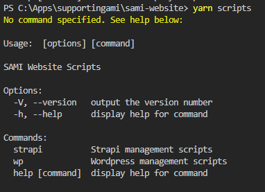
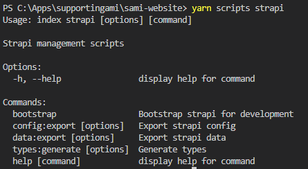

# Development Scripts

Various development scripts exist to facilitate various development tasks

Commands are located `scripts\src\commands`, and namespaced depending on type of task, and will often contain various subcommands

A list of all top-level commands can be seen via

```sh
yarn scripts
```



Subcommands can then be interrogated in the same way, e.g.

```sh
yarn scripts strapi
```



## Command List

<!-- auto-generated from scripts-->

<!-- end auto-generated -->
